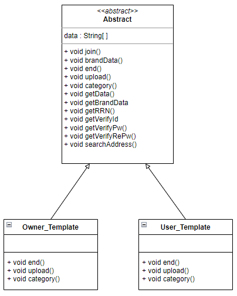
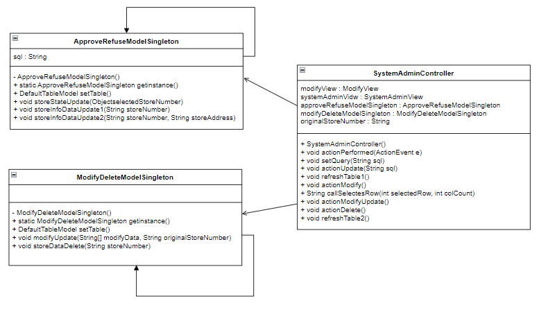
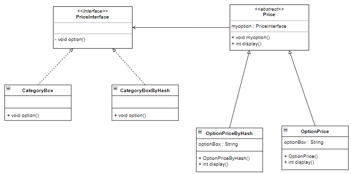
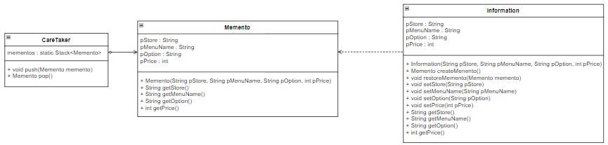

# 2021년도 3학년 1학기 소프트웨어설계공학
<h2 align=left>1분반 3조 음식주문 및 결제 시스템</h2>

## 목차

1. [배경](#1-배경)
2. [개발 환경](#2-개발-환경)
3. [디자인 패턴](#3-디자인-패턴)
4. [발표 영상](#4-발표-영상)

## 1. 배경

&nbsp;COVID-19 바이러스로 인해 언택트 쇼핑의 추세가 높아짐에 따라 전자상거래 어플리케이션이 활발하게 사용되고 있다.</br> 전자기기, 가구, 의류 등 여러 분야의 전자상거래 어플이 존재하는 가운데 가장 많이 사용되는 배달 음식 어플인 '배달의 민족'을 모티브로 하여 본 프로젝트를 기획하였다.

&nbsp; 본 프로젝트는 각 가맹점의 메뉴에 공통적인 해시태그로 메뉴를 구분하여 검색가능하게 구현할 예정이다.

## 2. 개발 환경

```
* Language : Java
* Platform : NetBeans 11.3
* DB : MySQL 5.6
* Tools : JAVA SWING
```

## 3. 디자인 패턴

### 1. Template Method 패턴</br>
<br/>
#### 문제점<br/>
일반 사용자 회원가입과, 가맹점주 회원가입으로 나뉘어 각각 회원가입을 해야 하는데, 회원가입에서 사용하는 변수 및 메소드의 대부분이 겹치는 현상이 발생한다.<br/>
해당 프로그램을 사용하는 사용자의 구분에 따라 손쉽게 사용할 수 있게 만드는 것이 목표이지만 코드의 중복으로 인해 불필요한 메모리 소비와 코드의 변경, 유지보수가 어렵다는 문제가 발생한다.<br/><br/>
**해결방안**<br/>
두 회원가입에 대한 메소드를 정리한 추상 클래스를 구현하여, 해당 클래스 내에 똑같은 역할을 하는 메소드를 구현한다. 각 프레임에서 사용하는 변수들을 받을 함수를 선언하여 값을 받아온 뒤, 메소드를 구현하여 어느 프레임에서도 같은 역할을 수행할 수 있게 구현한다.<br/>
각기 다르게 기능하는 메소드는 추상 메소드로 선언한 뒤, 각 템플릿 클래스에서 Override시켜 구현하여 위의 문제를 해결하였다.<br/>

### 2. Singleton 패턴</br>
<br/>
**문제점**<br/>
dd<br/><br/>
**해결방안**<br/>
ddd<br/>

### 3. Strategy 패턴</br>
</br>
**문제점**<br/>
dd<br/><br/>
**해결방안**<br/>
ddd<br/>

### 4. Memento 패턴</br>
<br/>
**문제점**<br/>
dd<br/><br/>
**해결방안**<br/>
ddd<br/>

## 4. 발표 영상

[](https://youtu.be/yPWcp_Xn3TY))

